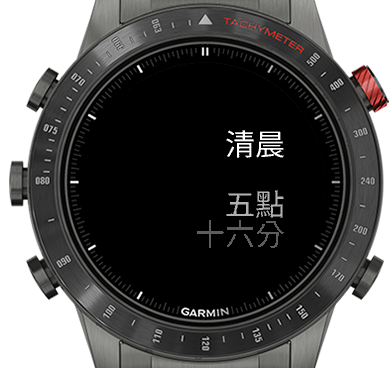

# Garmin Mandarin Clock

This is a Garmin Connect IQ watchface which simply tells time and time of day (period or part of a day) in Mandarin (Chinese) text.

## 中文介紹 

這是個Garmin Connect IQ錶面程式，顯示中文文字時間。

## Chinese Fonts

NOTE: This watchface does NOT require a APAC/Taiwan/China/HK model to be able to display Chinese.

I'm using the excellent project [garmin-tilemapper](https://github.com/sunpazed/garmin-tilemapper) by Franco Trimboli to build custom Chinese font used in this project. 

I've made a small modification to be able to get font height in CIQ. See [my fork here](https://github.com/starryalley/garmin-tilemapper)

